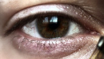

# justeyecenters

Just does eye centers.

Implemented based on `Timm, F. and Barth, E. (2011). "Accurate eye centre localisation by means of gradients"`.

## Example

Input|Predicted output
---|---
|